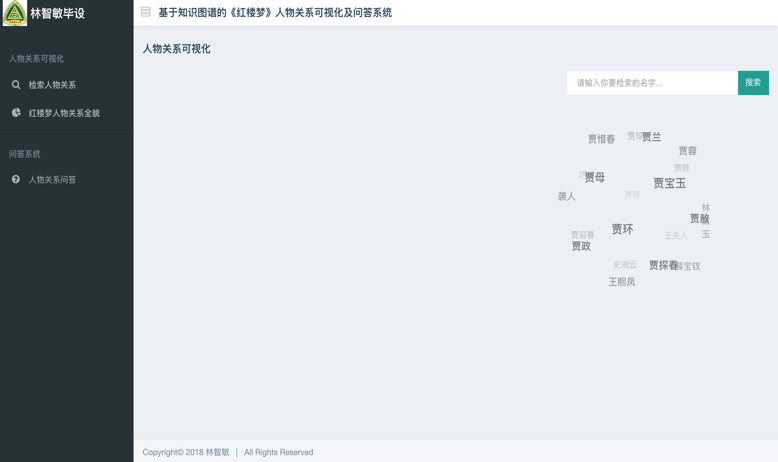
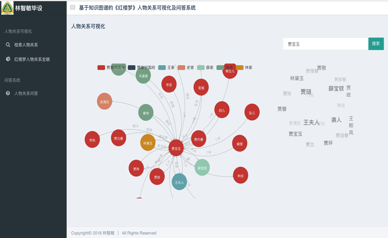
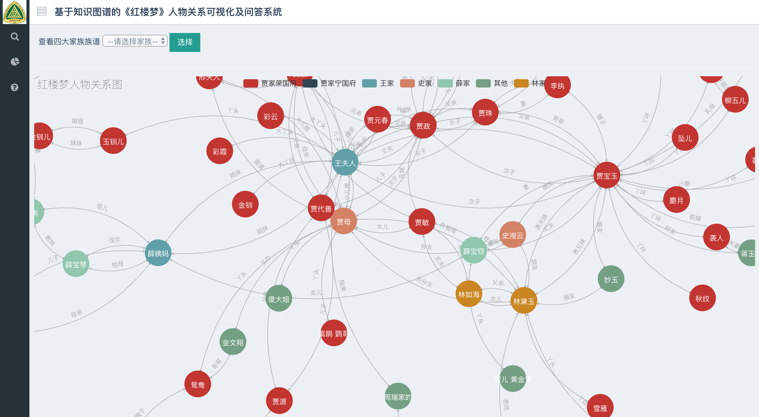
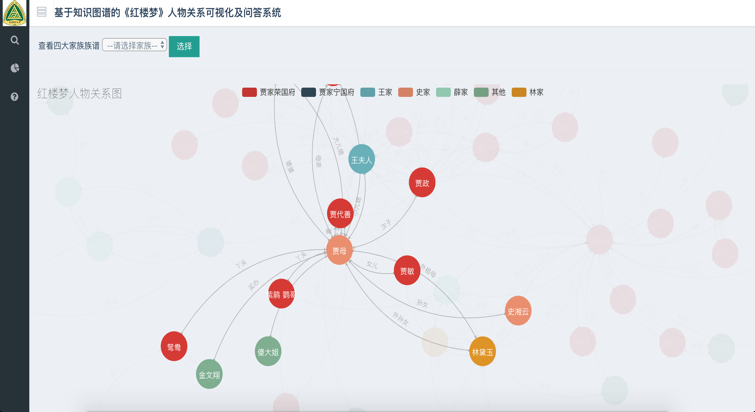
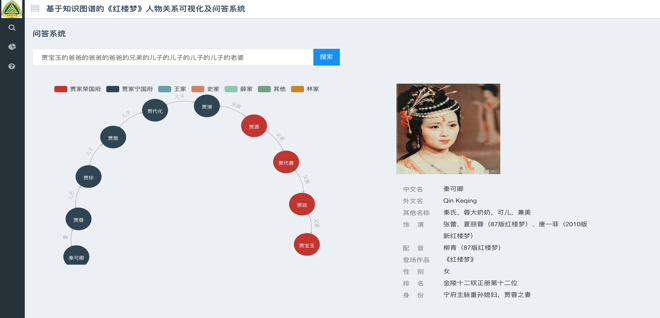

# KGQA_HLM

基于知识图谱的《红楼梦》人物关系可视化及问答系统

[](https://github.com/chizhu/KGQA_HLM)
[](https://www.python.org/downloads/release/python-360/)
[](https://github.com/chizhu/KGQA_HLM/issues)
[](https://github.com/chizhu/KGQA_HLM)
[](https://github.com/996icu/996.ICU/blob/master/LICENSE)

文件树:

```txt
1) app.py是整个系统的主入口
2) templates文件夹是HTML的页面
     |-index.html 欢迎界面
     |-search.html 搜索人物关系页面
     |-all_relation.html 所有人物关系页面
     |-KGQA.html 人物关系问答页面
3) static文件夹存放css和js，是页面的样式和效果的文件
4) raw_data文件夹是存在数据处理后的三元组文件
5) neo_db文件夹是知识图谱构建模块
     |-config.py 配置参数
     |-create_graph.py 创建知识图谱，图数据库的建立
     |-query_graph.py 知识图谱的查询
6) KGQA文件夹是问答系统模块
     |-ltp.py 分词、词性标注、命名实体识别
7) spider文件夹是爬虫模块
     |- get_*.py 是之前爬取人物资料的代码，已经产生好images和json 可以不用再执行
     |-show_profile.py 是调用人物资料和图谱展示在前端的代码
```

--------

部署步骤：

* `pip install -r requirements.txt`
* 1.先下载好neo4j图数据库，并配好环境（注意neo4j需要jdk8）。修改neo_db目录下的配置文件config.py,设置图数据库的账号和密码。
* 2.`python neo_db/create_graph.py` 建立知识图谱
* 5.运行`python app.py`,浏览器打开[localhost:5000](http://localhost:5000)即可查看

系统整体流程图：


网站示例:
欢迎界面


主界面









搜索“贾宝玉的爸爸的爸爸的爸爸的兄弟的儿子的儿子的儿子的儿子的老婆”

